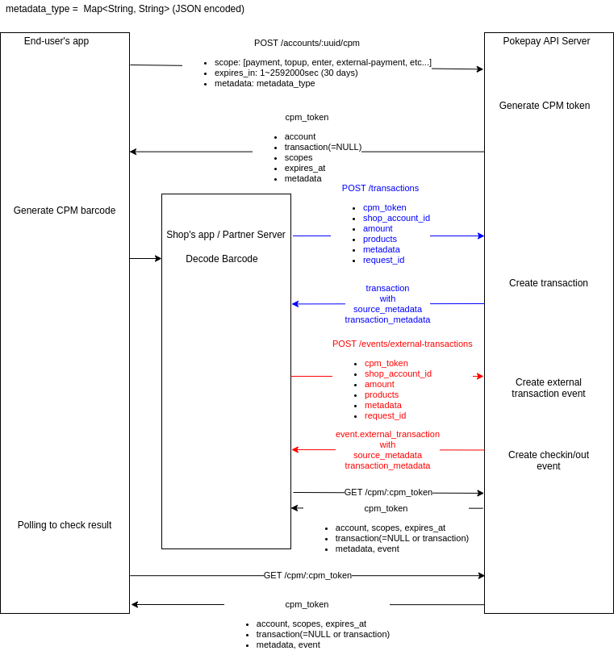

# CPM決済仕様
CPM決済はエンドユーザがコードを提示するタイプの取引形態である。エンドユーザ側、店舗ユーザのそれぞれからメタデータの入力を受け付ける。

## CPM決済の流れ
- エンドユーザがAPI(`POST /accounts/:uuid/cpm`)と通信しCPMトークンを生成
  - この際エンドユーザアプリはエンドユーザの外部IDやアプリ内の状態などをメタデータとして付けることができ、店舗はAPIからそれを参照できる(`GET /cpm/:cpm_token`)。メタデータは全てのキーと値のペアが文字列であるようなフラットな構造のJSONオブジェクトで指定する
- エンドユーザは22桁のCPMトークンをスマホ等にバーコードや二次元コードとして表示する
- それを店舗ユーザが読み取り解析し、22桁のCPMトークンを得る
- 店舗ユーザがCPMトークンをつけて決済API(Bank APIの`POST /transactions`やPartner APIの`CreateCpmTransaction`、`CreateCpmTransaction`、`CreateCpmExternalTransactionEvent`)を呼ぶことにより取引が完了する
  - この際店舗は自店舗のID、取引金額に加え、商品情報などのメタデータを付けることができる。これらは取引情報と紐付けて保存される。メタデータは全てのキーと値のペアが文字列であるようなフラットな構造のJSONオブジェクトで指定する
  - CPMトークンはCPM決済の成否に関わらずワンタイムで失効する
  - CPMトークンを付けて決済APIを呼べるのは店舗ユーザのみである
  - 羃等性の担保のために、決済APIにはオプショナルなパラメータとして`request_id`を付けることができ、決済リクエスト後にPartner APIの`GetTransactionResult`、`GetExternalTransactionResult`で取引の結果を確認できる
- エンドユーザ/店舗ユーザはAPI(`GET /cpm/:cpm_token`)を通して任意のタイミングで取引の状態/エラー事由を取得できる
  - 店舗はこのAPIを通じて相手方のエンドユーザのID(ユーザID/アカウントID)や、CPMトークン生成時にエンドユーザ側から指定されたメタデータを取得できる


https://drive.google.com/file/d/1FV5bSv4SQ5hNEr8gMtxfvSQwUD8B3G8U/view?usp=sharing

## CPMトークンのフォーマット
- CPMトークンは22桁の文字列
- 先頭8桁はJPQRの事業者コードでポケペイの場合`90000022`
- その次4桁はBase64(url-safe)文字列で、マネーのUUIDの先頭3byte(16進表記で6桁)。例: `u48I` → マネーUUIDの冒頭6桁 `bb8f08` <!-- (loop for oct across (jose/base64:base64url-decode "u48I") do (format t "~2,'0x" oct)) -->
  - 同一発行体マネーUUIDの先頭3byteが衝突しないようにマネー生成時にチェックする必要がある
- その次2桁は16進数: そのCPMトークンで実行可能な操作のスコープをon/off のbitmap形式で持たせる (1byte 8種類のスコープon/offをつけられるようにする。例: external-transaction, topup, paymentの場合 `07 (0b00000111)`
- 残り8桁はBase64(url-safe)文字列で、ランダム生成される
- 1次元バーコードの場合、CODE128でエンコードする


### CPMトークンのデータ構造
CPMトークンはDBには以下の情報を持っている
- token: キーとしての22桁の文字列
- account: 発行者（エンドユーザ）のアカウント情報
- transaction: 取引に成功していた場合はtransactionへの参照が入り、そうでなければNULL
- event: 外部イベントに成功していればeventへの参照が入り、そうでなければNULL
- scopes: そのCPMトークンに許されたアクションの一覧。(ex. payment, topup, enter, external-transaction etc...)
- expires_at: CPMトークン自体の有効期限(秒)。漏洩時のリスクを限定するため、またCPMトークンのランダム部分の枯渇を防ぐために、有効期限が来たものから7日ほどのバッファを置いてWorkerで消していく。デフォルトは10分(600秒)。最大で30日(2592000秒)
- metadata: エンドユーザアプリ側から渡ってくるメタデータ。全てのキーと値のペアが文字列であるようなフラットな構造のJSONオブジェクトで指定する

## API仕様

### Bank API

#### CPMトークン生成API (`POST /accounts/:uuid/cpm`)

- Request
  - Path parameter
    - `:uuid`: エンドユーザのアカウントID
  - Body parameter
    - `scopes`: CPMトークンに許可されたアクションのリスト (例: `payment`, `topup`, `external-event`, ...)
    - `expires_in`: CPMトークンの有効期限。秒で指定。デフォルトは10分。最大30日
    - `metadata`: エンドユーザが付けたメタデータ。全てのキーと値のペアが文字列であるようなフラットな構造のJSONオブジェクトで指定する。Map<String,String> = {"string": "string"}
    - `keep_alive`: 別のCPMトークンを発行したときにこのCPMトークンが無効化されるかどうかのフラグ。boolean。デフォルトはfalseで、新規に別のCPMトークンを作ったらこのCPMトークンは無効化される。これをtrueにすると、新規にCPMトークンを作っても無効化されずに並行して残り続ける
- Response
  - `account`: CPMトークンを生成したエンドユーザのアカウント
  - `transaction`: 取引成功済みの場合、取引情報が入る。未処理の場合は`NULL`
  - `event`: イベント登録済みの場合、イベント情報が入る。未処理の場合は`NULL`
  - `scopes`: CPMトークンに許可されたアクションのリスト (例: `payment`, `topup`, `external-event`, ...)
  - `expires_in`: CPMトークンの有効期限。秒で指定。デフォルトは10分。最大30日
  - `metadata`: エンドユーザが付けたメタデータ。全てのキーと値のペアが文字列であるようなフラットな構造のJSONオブジェクトで指定する。Map<String,String> = {"string": "string"}

#### CPM決済API (`POST /transactions/cpm`)

- Request
  - Path parameter
  - Body parameter
    - `account_id (required)`: 店舗アカウントID
    - `cpm_token (required)`: CPMトークン
    - `amount (required)`: 正の値ならtopup、負の値ならpaymentになる(cashtrayと一緒)
    - `description`: 取引説明文。最大200字の文字列
    - `metadata`: 店舗ユーザが付けるメタデータ。任意のJSON（ただしフラットな構造でvalueは文字列のみ）
    - `products`: 商品情報。以下の内容からなるJSONオブジェクトの配列
      - `jan_code`: JANコード。64字以下の文字列
      - `name`: 商品名。256字以下の文字列
      - `unit_price`: 商品単価。0以上の数値
      - `price`: 商品金額(例: 商品単価 × 個数)。0以上の数値
      - `is_discounted`: 賞味期限が近いなどの理由で商品が値引きされているかどうかのフラグ。boolean
      - `other`: その他商品に関する情報。JSONオブジェクト
    - `request_id`: 羃等性を担保するためのリクエスト固有のID。36文字以内の任意文字列(ランダムなUUID推奨)。request_idが指定されている場合、取引が未完了なら新規に取引を作りその結果を返し、既に取引が完了していれば失敗する
 
- Response
  - `id`: 取引ID
  - `user`: APIを呼んだユーザの相手方ユーザのユーザ情報(CPM決済APIは店舗が呼ぶので、エンドユーザ)
  - `balance`: APIを呼んだユーザの残高
  - `customer_balance`: (店舗ユーザ呼び出し時のみ)取引相手方(エンドユーザ)の残高
  - `amount`: money_amountとpoint_amountの和
  - `money_amount`: マネー部分のみの金額
  - `point_amount`: ポイント部分のみの金額
  - `account`: APIを呼んだユーザのアカウント情報
  - `done_at`: 取引完了時刻
  - `description`: 取引説明文。最大200字の文字列
  - `type`: 取引種別
  - `is_modified`: キャンセルされているかどうか(boolean)。修正がある場合は部分キャンセル、完全キャンセルに関わらず真になる
  - `products`: 商品情報 (new)
  - `source_metadata`: CPMトークン作成時にエンドユーザが指定したメタデータ。全てのキーと値のペアが文字列であるようなフラットな構造のJSONオブジェクトで指定する。Map<String,String> = {"string": "string"}
  - `transaction_metadata`: 決済API呼び出し時に指定したメタデータ。全てのキーと値のペアが文字列であるようなフラットな構造のJSONオブジェクトで指定する。Map<String,String> = {"string": "string"}

#### CPMトークンの状態取得API (`GET /cpm/:cpm_token`)
エンドユーザ/店舗ユーザが取引の状態を確認するためにポーリングするエンドポイント。
制約: CPMトークンを発行したユーザ自身か、CPMトークンに対応するエンドユーザアカウントと同一マネーのアカウントを保有する店舗ユーザからのみ参照できる。

- Request
  - Path parameter
    - `cpm_token`: 22桁の文字列
- Response
  - `cpm_token`: 22桁の文字列
  - `account`: CPMトークンを生成したエンドユーザのアカウント。アカウントの残高、ユーザ情報を含む
  - `transaction`: 取引成功済みの場合、取引情報が入る。未処理の場合は`NULL`
  - `event`: イベント登録済みの場合、イベント情報が入る。未処理の場合は`NULL`
  - `scopes`: CPMトークンに許可されたアクションのリスト (例: `payment`, `topup`, `external-event`, ...)
  - `expires_in`: CPMトークンの有効期限。秒で指定。デフォルトは10分。最大30日
  - `metadata`: エンドユーザが付けたメタデータ (new)
  - `attempt`: CPMトークンを店舗が読み取り、決済APIを呼ばれた試行結果。未処理の場合は`NULL` (new)
    - `shop_user`: 決済APIを呼んだ店舗
    - `shop_account`: 決済APIを呼んだ店舗アカウント
    - `status_code`: ステータスコード
    - `error_type`: 取引時のエラー型、成功時は`NULL`
    - `error_message`: 取引時のエラーメッセージ、成功時は`NULL`
    - `created_at`: 決済APIが呼ばれた時刻

### Partner API

#### CPM決済API (`POST /transactions/cpm`, `CreateCpmTransaction`)
CPMトークンはワンタイムであり、取引の成否に関わらず一度きりで失効する。

- Request
  - `cpm_token (required)`: 22桁の文字列
  - `shop_id (required)`: 店舗のユーザID(uuid)
  - `amount (required)`: 正の値ならtopup、負の値ならpaymentになる(cashtrayと一緒)
  - `description`: 取引説明文。最大200字の文字列
  - `metadata`: 店舗ユーザが付けるメタデータ。任意のJSON（ただしフラットな構造でvalueは文字列のみ）
  - `products`: 商品情報。以下の内容からなるJSONオブジェクトの配列
    - `jan_code`: JANコード。64字以下の文字列
    - `name`: 商品名。256字以下の文字列
    - `unit_price`: 商品単価。0以上の数値
    - `price`: 全体の金額(例: 商品単価 × 個数)。0以上の数値
    - `is_discounted`: 賞味期限が近いなどの理由で商品が値引きされているかどうかのフラグ。boolean
    - `other`: その他商品に関する情報。JSONオブジェクト
  - `request_id`: 羃等性を担保するためのリクエスト固有のID。ランダムなUUIDを指定する。request_idが指定されている場合、取引が未完了なら新規に取引を作りその結果を返し、既に取引が完了していれば失敗する。

Rubyコード例
```ruby
response = $client.send(Pokepay::Request::CreateCpmTransaction.new(
                          "90000022u48I07XXXXXXXX",                     # cpm_token
                          "8de6efd8-c2f2-4f7c-bf13-5b1cef066bf4",       # shop_id: 店舗ユーザーID
                          -300,                                         # amount: チャージ/支払い額
                          description: "カレー",                        # 取引履歴に表示する説明文
                          metadata: { external_id: "abc123" },          # transaction-metadata
                          products: { jan_code: "4569951116179",        # 商品情報
                                      name: "ハウスこくまろカレー140g",
                                      unit_price: 150,
                                      price: 300,
                                      other: {
                                        item_code: "4512345678901",
                                        amount: 2,
                                        amount_unit: "個"
                                      }}))
```

- Response
  - [Partner APIのTransactionオブジェクト](https://github.com/pokepay/pokepay_partner_ruby_sdk/blob/master/docs/index.md#transaction-1)
  - `products`: 商品情報 (new)
  - `source_metadata`: CPMトークン作成時にエンドユーザが指定したメタデータ (new)
  - `transaction_metadata`: 決済API呼び出し時に指定したメタデータ (new)

- Response
  - [Partner APIのTransactionオブジェクト](https://github.com/pokepay/pokepay_partner_ruby_sdk/blob/master/docs/index.md#transaction-1)
  
#### 取引キャンセルAPI (`POST /transactions/{transaction_id}/refund`, `RefundTransaction`)
取引IDを指定して取引をキャンセルする。
キャンセル対象の取引に付随するポイント還元キャンペーンやクーポン適用も取り消される。
チャージ取引のキャンセル時に返金すべき残高が足りないときは `account_balance_not_enough (422)` エラーが返る。
取引をキャンセルできるのは1回きり。既にキャンセルされた取引を重ねてキャンセルしようとすると `transaction_already_refunded (422)` エラーが返る。

- Request
  - Path parameter
    - `transaction_id`: 取引ID
  - Body parameter
    - `description`: 取引履歴などに表示する返金事由

Rubyコード例
```ruby
response = $client.send(Pokepay::Request::RefundTransaction.new(
                          "aa3d9379-c676-472c-a4ed-4219d7bfd32f,        # transaction_id
                          description: "レジでの数量間違え",            # 取引履歴に表示する説明文
                          ))
```

- Response
  - [Partner APIのTransactionオブジェクト](https://github.com/pokepay/pokepay_partner_ruby_sdk/blob/master/docs/index.md#transaction-1)

#### ポケペイ外部取引API (`POST /transactions/external-transactions`, `CreateExternalTransactionEvent`)
CPMトークンを利用せず、直接エンドユーザIDを指定してポケペイ外部取引イベントを作るAPI

- Request
  - `customer_id (required)`: エンドユーザのユーザID(uuid)
  - `shop_id (required)`: 店舗のユーザID(uuid)
  - `private_moeny_id (required)`: マネーID(uuid)
  - `amount (required)`: 正の値ならtopup、負の値ならpaymentになる(cashtrayと一緒)
  - `description`: 取引説明文。最大200字の文字列
  - `metadata`: 店舗ユーザが付けるメタデータ。任意のJSON（ただしフラットな構造でvalueは文字列のみ）
  - `products`: 商品情報。以下の内容からなるJSONオブジェクトの配列
    - `jan_code`: JANコード。64字以下の文字列
    - `name`: 商品名。256字以下の文字列
    - `unit_price`: 商品単価。0以上の数値
    - `price`: 全体の金額(例: 商品単価 × 個数)。0以上の数値
    - `is_discounted`: 賞味期限が近いなどの理由で商品が値引きされているかどうかのフラグ。boolean
    - `other`: その他商品に関する情報。JSONオブジェクト
  - `request_id`: 羃等性を担保するためのリクエスト固有のID。ランダムなUUIDを指定する。request_idが指定されている場合、取引が未完了なら新規に取引を作りその結果を返し、既に取引が完了していれば失敗する。

Rubyコード例
```ruby
response = $client.send(Pokepay::Request::CreateCpmTransaction.new(
                          "90000022u48I07XXXXXXXX",                     # cpm_token
                          "8de6efd8-c2f2-4f7c-bf13-5b1cef066bf4",       # shop_id: 店舗ユーザーID
                          -300,                                         # amount: チャージ/支払い額
                          description: "カレー",                        # 取引履歴に表示する説明文
                          metadata: { external_id: "abc123" },          # transaction-metadata
                          products: { jan_code: "4569951116179",        # 商品情報
                                      name: "ハウスこくまろカレー140g",
                                      unit_price: 150,
                                      price: 300,
                                      other: {
                                        item_code: "4512345678901",
                                        amount: 2,
                                        amount_unit: "個"
                                      }}))
```

- Response
  - [Partner APIのTransactionオブジェクト](https://github.com/pokepay/pokepay_partner_ruby_sdk/blob/master/docs/index.md#transaction-1)
  - `products`: 商品情報 (new)
  - `source_metadata`: CPMトークン作成時にエンドユーザが指定したメタデータ (new)
  - `transaction_metadata`: 決済API呼び出し時に指定したメタデータ (new)

- Response
  - [Partner APIのTransactionオブジェクト](https://github.com/pokepay/pokepay_partner_ruby_sdk/blob/master/docs/index.md#transaction-1)

#### ポケペイ外部取引イベントAPI(CPM) (`POST /events/external-transactions/cpm`, `CreateCpmExternalTransactionEvent`)
現金決済などのポケペイ外の取引イベントを作成する。通常の取引内容に加えて商品情報、その他のメタデータを受け付ける。
CPMトークンはワンタイムであり、イベントの成否に関わらず一度きりで失効する。
通常のtransactionと同様にUUIDが割り振られ、IDを指定して参照、キャンセルができる必要がある。
ポケペイ外の取引であるためポイントは持たない。

- Request
  - `cpm_token (required)`: 22桁の文字列
  - `shop_id (required)`: 店舗のユーザID(uuid)
  - `amount (required)`: 正の値ならtopup、負の値ならpaymentになる(cashtrayと一緒)
  - `description`: 取引説明文。最大200字の文字列
  - `metadata`: 店舗ユーザが付けるメタデータ。任意のJSON（ただしフラットな構造でvalueは文字列のみ）
  - `products`: 商品情報。以下の内容からなるJSONオブジェクトの配列
    - `jan_code`: JANコード。64字以下の文字列
    - `name`: 商品名。256字以下の文字列
    - `unit_price`: 商品単価。0以上の数値
    - `price`: 全体の金額(例: 商品単価 × 個数)。0以上の数値
    - `is_discounted`: 賞味期限が近いなどの理由で商品が値引きされているかどうかのフラグ。boolean
    - `other`: その他商品に関する情報。JSONオブジェクト
  - `request_id`: 羃等性を担保するためのリクエスト固有のID。36文字以内の任意文字列(ランダムなUUID推奨)。request_idが指定されている場合、取引が未完了なら新規に取引を作りその結果を返し、既に取引が完了していれば失敗する。

- Response
  - `event_id`: 外部取引のイベントID
  - `user`: エンドユーザの情報([Partner APIのUserオブジェクト](https://github.com/pokepay/pokepay_partner_ruby_sdk/blob/master/docs/index.md#user))
  - `account`: エンドユーザのアカウント情報([Partner APIのAccountオブジェクト](https://github.com/pokepay/pokepay_partner_ruby_sdk/blob/master/docs/index.md#account-1))
  - `amount`: 取引金額
  - `products`: 商品情報 (new)
  - `source_metadata`: CPMトークン作成時にエンドユーザが指定したメタデータ (new)
  - `transaction_metadata`: 決済API呼び出し時に指定したメタデータ (new)

#### ポケペイ外部取引キャンセルAPI (`POST /events/external-transactions/{event_id}/refund`, `RefundExternalTransaction`)
ポケペイ外部取引IDを指定して取引をキャンセルする。
キャンセル対象の取引に付随するポイント付与等も取り消される。
取引をキャンセルできるのは1回きり。既にキャンセルされた取引を重ねてキャンセルしようとすると `transaction_already_refunded (422)` エラーが返る。

- Request
  - Path parameter
    - `event_id`: 外部取引イベントID
  - Body parameter
    - `amount`: 返金額。省略時は全額返金する
    - `description`: 取引履歴などに表示する返金事由

Rubyコード例
```ruby
response = $client.send(Pokepay::Request::RefundExternalTransaction.new(
                          "aa3d9379-c676-472c-a4ed-4219d7bfd32f,        # event_id
                          description: "レジでの数量間違え"             # 取引履歴に表示する説明文
                          ))
```

- Response
  - `CreateCpmExternalTransactionEvent`のレスポンス形式と同じ

#### CPMトークンの状態取得API (`GET /cpm/:cpm_token`, `GetCpmToken`)
エンドユーザ/店舗ユーザが取引の状態を確認するためにポーリングするエンドポイント。
制約: CPMトークンを発行したユーザ自身か、CPMトークンに対応するエンドユーザアカウントと同一マネーのアカウントを保有する店舗ユーザからのみ参照できる。

- Request
  - `cpm_token (required)`: 22桁の文字列
  
Rubyコード例
```ruby
response = $client.send(Pokepay::Request::GetCpmToken.new("90000022u48I07XXXXXXXX"))
```

- Response
  - `cpm_token`: CPMトークン文字列。22文字
  - `account`: CPMトークンを生成したエンドユーザのアカウント。エンドユーザの残高情報を含む
  - `transaction`: 取引成功済みの場合、取引情報が入る。未処理の場合は`NULL`
  - `event`: イベント登録済みの場合、イベント情報が入る。未処理の場合は`NULL`
  - `scopes`: CPMトークンに許可されたアクションのリスト (例: `payment`, `topup`, `external-event`, ...)
  - `expires_at`: CPMトークンの有効期限のタイムスタンプ
  - `metadata`: エンドユーザが付けたメタデータ (new)
  - `attempt`: CPMトークンを店舗が読み取り、決済APIを呼ばれた試行結果。未処理の場合は`NULL` (new)
    - `shop_user`: 決済APIを呼んだ店舗
    - `shop_account`: 決済APIを呼んだ店舗アカウント
    - `status_code`: ステータスコード
    - `error_type`: 取引時のエラー型、成功時は`NULL`
    - `error_message`: 取引時のエラーメッセージ、成功時は`NULL`
    - `created_at`: 決済APIが呼ばれた時刻
